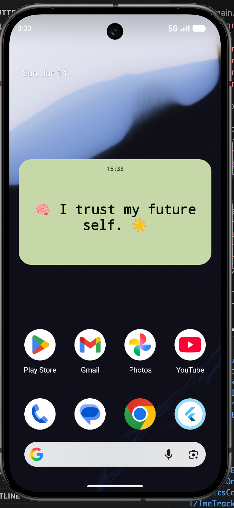
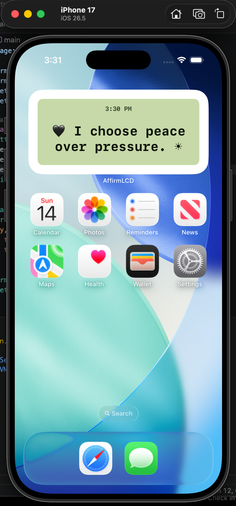

# AffirmLCD

**AffirmLCD** is a minimal retro LCD-style affirmation home screen widget for **Android and iOS**.

It brings short, calm, aesthetic affirmations directly to the phone home screen with an old-phone text message feeling. The app lets users create, edit, delete, and manage their own affirmation list, while the native home screen widget displays one affirmation at a time in a clean LCD-inspired design.

---

## Preview

| Android Widget                                                      | iOS Widget                                                  |
| ------------------------------------------------------------------- | ----------------------------------------------------------- |
|  |  |


---

## Project Description

AffirmLCD is designed for users who want a soft, mindful, and visually aesthetic reminder system on their phone home screen.

Instead of opening a full app every time, users can glance at a small LCD-style widget and receive a simple affirmation such as:

```text
✨ I am becoming her.
🌙 Soft life, strong mind.
📟 One calm thought at a time.
🌱 Small steps still count.
```

The project uses Flutter for the main app experience and native widget systems for real home screen widgets.

---

## Key Features

* Real Android home screen widget
* Real iOS WidgetKit home screen widget
* Flutter app for managing affirmations
* Add, edit, and delete affirmations
* Default Pinterest-style affirmation collection
* Local internal database only
* No cloud database required
* Widget updates when affirmation data changes
* Tap widget to open the affirmation list
* Responsive widget layout
* Old phone LCD / retro text message visual style
* Matching in-app preview and native widget design
* Safe fallback states for empty or unavailable data

---

## Tech Stack

### App

* Flutter
* Dart
* Local internal storage/database

### Android Widget

* Native Android App Widget
* AppWidgetProvider
* RemoteViews
* Shared widget data

### iOS Widget

* WidgetKit
* SwiftUI
* App Group storage
* Timeline reload support

---

## Design Theme

AffirmLCD follows a minimal **retro-futuristic LCD message screen** style.

Design direction:

* Dark LCD-style background
* Greenish text glow feeling
* Monospace / pixel-inspired typography
* Text and emojis only
* No heavy graphics
* No clutter
* No unnecessary borders
* Soft rounded layout
* Calm Pinterest-style affirmation vibe

---

## Widget Behavior

The widget displays one affirmation at a time.

It updates when:

* The app opens
* The app resumes
* The user adds a new affirmation
* The user edits an affirmation
* The user deletes an affirmation
* The user taps refresh inside the app
* The widget timeline refreshes where supported

Platform note:

Android can support more flexible widget update behavior, but some background updates may still depend on the device and launcher.

iOS WidgetKit does not allow guaranteed refresh every time the phone screen turns on. The app uses the closest reliable behavior supported by iOS, such as app-triggered updates and WidgetKit timeline refresh.

---

## App Features

Inside the Flutter app, users can:

* View all saved affirmations
* Add new affirmations
* Edit existing affirmations
* Delete affirmations
* See a preview of how the widget looks
* Refresh the currently displayed affirmation
* Open the app from the home screen widget

If the local database is not available, add/edit/delete actions are safely blocked to prevent data loss.

---

## Default Affirmations

AffirmLCD includes a default affirmation collection on first launch.

Example affirmations:

```text
✨ I am becoming her.
🌙 Soft life, strong mind.
📟 One calm thought at a time.
🖤 I choose peace over pressure.
🌱 Small steps still count.
🪞 I am allowed to grow slowly.
☁️ My energy is precious.
🧠 I trust my future self.
```

Default affirmations are seeded only once and can be edited or deleted by the user.

---

## Folder Structure

```text
affirmlcd-home-widget/
├── lib/
│   ├── affirmation.dart
│   ├── affirmation_store.dart
│   ├── affirmation_service.dart
│   ├── affirmation_list_screen.dart
│   ├── widget_preview.dart
│   ├── widget_design.dart
│   ├── widget_update_service.dart
│   └── main.dart
│
├── android/
│   └── app/
│       └── src/main/
│           ├── AndroidManifest.xml
│           ├── res/
│           └── kotlin/
│
├── ios/
│   ├── Runner/
│   └── AffirmationWidget/
│
├── assets/
│   └── screenshots/
│       ├── android-widget.png
│       └── ios-widget.png
│
└── README.md
```

---

## Assets

Screenshot assets live in:

```text
assets/screenshots/
```

Expected files:

```text
android-widget.png
ios-widget.png
```

Placeholder files are included so the paths exist. Replace them with real screenshots when available.

---

## Screenshots Setup

Create this folder:

```text
assets/screenshots/
```

Add these two images:

```text
android-widget.png
ios-widget.png
```

Then the README preview table will automatically show both screenshots.

---

## Development Status

Current status:

```text
MVP / Prototype
```

Planned improvements:

* More widget size variations
* More theme presets
* Custom font selection
* Daily affirmation scheduling
* Favorite affirmations
* Backup/export option
* Premium aesthetic widget themes

---

## Commercial Positioning

AffirmLCD can be positioned as a small wellness and lifestyle utility app for users who like:

* Daily affirmations
* Soft life aesthetic
* Pinterest-style self-growth content
* Minimal widgets
* Retro phone visuals
* Calm productivity
* Mindset reminders

Possible future monetization:

* Premium widget themes
* Custom affirmation packs
* Daily mindset collections
* Personalized affirmation categories
* iOS/Android paid app release

---

## License

This project is private/prototype unless a license is added.

---

## Author

Built by **rashsvr**.

```text
Retro thoughts. Soft reminders. One affirmation at a time.
```
